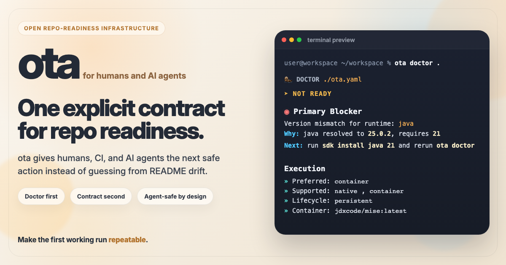

<!--
                █████
               ░░███
       ██████  ███████    ██████
      ███░░███░░░███░    ░░░░░███
     ░███ ░███  ░███      ███████
     ░███ ░███  ░███ ███ ███░░███
     ░░██████   ░░█████ ░░████████
      ░░░░░░     ░░░░░   ░░░░░░░░

   Copyright (C) 2026 — 2026, Ota. All Rights Reserved.

   DO NOT ALTER OR REMOVE COPYRIGHT NOTICES OR THIS FILE HEADER.

   Licensed under the Apache License, Version 2.0. See LICENSE for the full license text.
   You may not use this file except in compliance with that License.
   Unless required by applicable law or agreed to in writing, software distributed under the
   License is distributed on an "AS IS" BASIS, WITHOUT WARRANTIES OR CONDITIONS OF ANY KIND,
   either express or implied. See the License for the specific language governing permissions
   and limitations under the License.

   If you need additional information or have any questions, please email: os@ota.run
-->

<div align="center">
  
</div>

# `ota`

<div align="center">
  
</div>

<div align="center"><strong>DOCTOR FIRST, CONTRACT SECOND.</strong></div>

## What problem ota solves

Most repos fail the same way:

- setup lives in README prose, shell scripts, and tribal knowledge instead of one contract
- new contributors guess which tools, versions, and paths they need
- CI and local setup drift apart
- diagnosis happens too late, after the repo already feels broken

ota is not another task runner or package manager. It gives every repo one explicit contract for
what it needs, how it is diagnosed, how it is prepared, and how tasks run, so humans and AI agents
can answer why a repo is or is not runnable without guesswork.

ota fixes that by making readiness explicit and machine-readable:

- `ota doctor` tells you what is missing and why
- `ota init` writes a starter contract when the repo needs one
- `ota up` prepares the repo from the contract instead of from guesswork
- `ota run` executes tasks through the same declared contract
- `ota detect` turns repo signals into a contract you can review when you are authoring or refining the file

The result is a repo that is easier to trust, easier to onboard, and easier to keep consistent across humans, AI agents, CI, and containers.

## Installation

Install the latest release binary:

```bash
curl -fsSL https://dist.ota.run/install.sh | sh
```

Windows PowerShell:

```powershell
irm https://dist.ota.run/install.ps1 | iex
```

Windows Git Bash, MSYS, MinGW, or Cygwin:

```bash
curl -fsSL https://dist.ota.run/install.sh | sh
```

Pin a release:

```bash
OTA_VERSION=vX.Y.Z curl -fsSL https://dist.ota.run/install.sh | sh
```

Windows PowerShell:

```powershell
$env:OTA_VERSION = "vX.Y.Z"
irm https://dist.ota.run/install.ps1 | iex
```

Update an existing install:

```bash
ota upgrade
```

Install from a local checkout:

```bash
./scripts/install.sh --from-source
```

Windows PowerShell:

```powershell
powershell -ExecutionPolicy Bypass -File .\scripts\install.ps1 -FromSource
```

See [docs/installation.md](docs/installation.md) for mirror/CDN overrides and source fallback details.

## Quickstart

Choose the path that matches the repo.

### Existing repo with `ota.yaml`

Start with the read path:

```bash
ota doctor
ota explain
ota up
ota agents
ota run <task>
```

This path tells you what is wrong, turns the findings into an ordered plan, prepares the repo,
derives repo-local agent guidance from the same contract, and gives you one declared task path
without guessing.

If the repo is meant to run inside a container, use:

```bash
ota doctor --mode container
```

If you are not sure which task to run after `ota up`, use:

```bash
ota tasks --use
```

### Repo without `ota.yaml`

Use the authoring path first:

```bash
ota doctor
ota explain
ota detect --dry-run .
ota init --dry-run
```

Then choose one explicit write path:

```bash
ota init
# or:
ota detect --write .
```

If you want an explicit conventional starter instead of detector-led init, use a pack:

```bash
ota init --pack node
# or:
ota init --pack python --dry-run
```

### Existing repo with `ota.yaml`, but contract drift is suspected

Review the delta before writing:

```bash
ota detect --merge --dry-run .
ota detect --rewrite --dry-run .
```

### Policy boundary review

Use the conservative policy scaffold first when a team needs a starter org policy pack:

```bash
ota policy init --dry-run
ota policy init
ota policy init --preset required-sections --dry-run
ota policy init --preset provisioning --dry-run
ota policy init --preset agent --dry-run
```

Use policy review when the contract and approved policy need to be reconciled:

```bash
ota policy review
```

### Agent guidance from the same contract

If you want repo-local agent guidance from the same contract:

```bash
ota agents
ota agents --write
```

### Workspace bootstrap

If you are setting up multiple repos together:

```bash
ota workspace doctor .
ota workspace up
ota workspace tasks .
ota workspace validate .
```

If the contract declares agent guidance, `ota doctor --json` and `ota explain --json` surface the
same safe-task, verification, and writable-path hints that humans can review in `ota.yaml`.

Example contracts:
- [basic-node](examples/basic-node/ota.yaml) - Node / TypeScript starter
- [basic-dotnet](examples/basic-dotnet/ota.yaml) - C# / .NET starter
- [basic-java](examples/basic-java/ota.yaml) - Maven starter
- [basic-rust](examples/basic-rust/ota.yaml) - Cargo starter
- [basic-script](examples/basic-script/ota.yaml) - Script-only starter
- [basic-services](examples/basic-services/ota.yaml) - Service-backed repo starter
- [full-contract](examples/full-contract/ota.yaml) - Full contract surface
- [workspace-acquire](examples/workspace-acquire/ota.workspace.yaml) - Workspace acquisition flow
- [ota-run/examples](https://github.com/ota-run/examples) - advanced, production-adjacent examples and templates

## Why ota exists

Repo setup truth is usually fragmented across:

- language manifests
- runtime version files
- task scripts
- container config
- CI config
- README setup notes
- tribal knowledge

ota consolidates that into one canonical contract:

```yaml
ota.yaml
```

The goal is not hidden automation. The goal is deterministic, inspectable repo readiness.

## Open Source and Governance

ota is maintainer-led open infrastructure for repo readiness. The core CLI, contracts, JSON output,
and docs are public under Apache 2.0, while roadmap stewardship and future enterprise offerings stay
operated by Ota.

ota is open source, but it is not positioned as a community-governed codebase.

- governance is maintainer-led by Ota so the contract, diagnosis model, and machine-readable surfaces stay coherent
- issues, bug reports, docs feedback, and real-repo examples are welcome
- external code contributions are not currently accepted

See [docs/policy/governance.md](docs/policy/governance.md) for the governance model and
[CONTRIBUTING.md](CONTRIBUTING.md) for the current contribution policy.

## What ota does today

The public command surface is in [docs/spec/command-reference.md](docs/spec/command-reference.md).
Start with `ota doctor`, then `ota validate`, `ota up`, and `ota run <task>`.

Near-term policy and provisioning direction:

- [Environment variables](docs/spec/env-resolution-and-policy.md)
- [Policy-backed provisioning sources](docs/spec/policy-backed-provisioning.md)
- [Policy inspection](docs/spec/command-reference.md#ota-policy)
- [Uninstall](docs/spec/command-reference.md#ota-uninstall)

Global flag:

```bash
ota --debug <command>
ota --plain <command>
```

`--debug` emits command-phase tracing to stderr without changing normal stdout.
`--plain` emits ASCII-first output without emoji, icons, or ANSI color.

Use `--debug` when you want command traces for `ota up`, `ota run <task>`, `ota workspace up`,
`ota workspace refresh`, `ota workspace diff`, `ota workspace status`, `ota workspace run <task>`, `ota doctor`, `ota detect`, `ota diff`, and
`ota explain`.
Commands like `ota validate`, `ota tasks`, `ota workspace validate`, `ota workspace tasks`, and
`ota workspace list` should usually stay quiet unless you are actively debugging.

Current behavior:

- `ota validate` parses and semantically validates `ota.yaml`
- `ota tasks` lists validated tasks and their execution form
- `ota run <task>` resolves dependencies and executes `run` or `script` tasks deterministically
- `ota diff` compares two contracts semantically and reports added, missing, and changed fields in deterministic order
- `ota explain` turns readiness findings into an ordered remediation plan
- `ota doctor` reports readiness findings for env, runtimes, tools, services, and checks with severity, explanation, and next action, still gives a useful repo/host diagnosis when no `ota.yaml` exists yet, leads with the highest-priority blocker first, and supports `ota doctor --mode container` for container-targeted readiness
- `ota init` creates a starter contract for repos that do not yet have `ota.yaml`, and both detector-led starters plus starter packs can seed short task `description` fields so users can see and refine that authoring pattern immediately
- `ota agents` exports or syncs a repo-local `AGENTS.md` from the contract’s agent guidance, preserves existing user-authored content by appending an ota-managed block, skips the write when the generated content is already present, and shows a `Managed block:` label in text output so the ota-owned section is explicit, including the `ota run ...` command form for each listed task
- `ota check` runs configured checks without runtime, tool, env, or task execution
- `ota up` validates, runs blocking preconditions, runs `setup` early when preconditions fail and the repo declares it, starts required services in declared dependency order, uses required service healthchecks as readiness gates, runs `setup` if present, and re-checks readiness
- `ota detect` (default) infers a candidate contract and prints provenance/confidence without writing
- `ota completion --setup` auto-installs shell completion for the current shell, `ota completion check` verifies the managed hook, current binary path, and any managed zsh completion file, `ota completion zsh` now prints both the `_ota` completion file and the `.zshrc` loader for self-contained manual setup, and `ota completion <shell> --script` prints the raw generated registration script; once sourced, `ota <TAB>` completes commands, `ota run <TAB>` completes task names only when one shared invocation can satisfy the selected repo/member target set and now includes task descriptions when the contract declares them, `ota run <task> <TAB>` completes shared task input flags plus constrained values, `ota env --task <TAB>` completes task names, `ota extensions --run/--publish <TAB>` completes declared extension names, `ota receipt --baseline <TAB>` completes `latest`, `promoted`, and archived receipt files from the active repo, `--member <TAB>` completes monorepo member names, and workspace completion suggests workspace-wide task names only when one shared invocation can satisfy the available repos, shared workspace task inputs, and declared repo names
- `ota detect --write` writes a contract conservatively from `high` confidence fields only
- `ota detect --merge --dry-run` compares detected repo signals against an existing `ota.yaml` without writing and surfaces stale contract fields that no longer match repo reality
- `ota detect --merge` applies only additive `high` confidence missing fields to an existing `ota.yaml`
- there is no standalone `ota drift` command yet; drift review stays on `ota detect --merge --dry-run` and trust/readiness drift stays on `ota doctor`
- `ota workspace validate` validates `ota.workspace.yaml` separately from repo contracts
- `ota workspace tasks` lists workspace repo tasks in dependency order without executing them
- `ota workspace run <task>` executes one task across workspace repos in dependency order with deterministic reporting
- `ota workspace explain` turns workspace readiness findings into ordered remediation steps
- `ota workspace check` runs configured checks across workspace repos with deterministic reporting
- `ota workspace doctor` aggregates repo readiness across a workspace contract without merging repo and workspace truth, including repos that are not acquired yet
- `ota workspace up` can acquire missing repos from git sources and then orchestrates repo-level `up` across the workspace contract without inventing a second bootstrap model
- `ota workspace refresh` re-syncs repos that already exist locally without cloning missing ones
- `ota workspace refresh --dry-run` previews the refresh commands without changing repo state
- `ota workspace refresh --force` hard-resets refreshed repos to the declared source or `--ref` override
- `ota workspace refresh --prune` drops stale remote-tracking refs during refresh
- `ota workspace refresh --ref <branch|tag|sha>` overrides the source ref used for refresh
- `ota workspace diff` compares local workspace repo state against the declared source without mutating anything
- `ota workspace status` combines readiness and drift into one read-only workspace summary
- `ota workspace receipt` captures the same workspace state as a read-only receipt artifact for CI and archiving
- editor and CI consumers should prefer `--json` surfaces such as `ota doctor --json`, `ota workspace doctor --json`, `ota workspace list --json`, and `ota up --json` instead of scraping text output

### Shell completion quickstart

Use the managed shell hook first:

```bash
ota completion --setup
ota completion check
```

If auto-detection is not available or you want one explicit shell:

```bash
ota completion zsh --setup
ota completion bash --setup
ota completion fish --setup
ota completion powershell --setup
ota completion elvish --setup
```

Once the shell has sourced that hook, ota keeps completion contract-aware instead of static: repo commands complete member names, task names, and task inputs from the active contract, while workspace commands complete declared repo names and only suggest workspace task names that remain runnable across the selected repo set.
Receipt compare flows also complete `latest`, `promoted`, and archived receipt JSON files from `.ota/receipts` so baseline selection stays discoverable at the shell.

## Execution Modes and Provisioning

ota supports three execution backends for task-oriented commands:

- `native` runs tasks on the host machine.
- `container` runs tasks in an OCI-compatible container using the image defined by the repo contract.
- `remote` runs tasks on a separate machine or workspace through a remote provider.

### Why the three modes exist

- `native` is the simplest path when the host already has the right toolchain and you want to debug against the real machine.
- `container` is the reproducible path when you want a fixed toolchain, deterministic setup, and CI-like behavior.
- `remote` is the off-host path when execution needs to happen somewhere else entirely, such as a dev box, cluster, or managed workspace.

### What ota does today

- `ota run` and `ota up` can execute through the configured backend path.
- `ota up` can run the `setup` task through the same backend selection as `ota run`.
- policy-backed provisioning adapters follow the same backend selection, so container-backed `ota up` provisions inside the container instead of on the host.
- `ota doctor` checks the prerequisites for the preferred backend and reports missing tools or suspicious remote target shape early.
- `ota clean` can remove persistent container state for container-backed repos.
- `ota clean --stale` can remove exited ota-managed containers across repos without requiring an `ota.yaml`, and it surfaces container-engine query failures instead of silently treating them as empty.

### What ota does not do today

- ota does not automatically install every missing host tool or language runtime.
- ota does not turn a laptop into a fully managed workstation.
- ota does not invent remote provisioning or remote workspace selection beyond the configured provider path.

### Container backend

Container execution is useful when you want ota to run repo tasks in a known environment instead of relying on whatever happens to be installed locally.

Benefits:

- removes drift in Java, Maven, shell, and other repo tool versions
- makes local execution closer to CI
- gives agents a stable execution surface
- supports persistent or ephemeral lifecycle behavior where the contract and command support it

Requirements:

- at least one supported container engine CLI must be installed and running
- the contract must declare `execution.backends.container.image`
- the image must be pullable and runnable by the selected engine

In this repository, the container image is:

```yaml
execution:
  preferred: container
  lifecycle: persistent
  supported:
    - native
    - container
  backends:
    container:
      image: rust:1.85
```

### Native backend

Native execution is useful when:

- you want to debug against the exact host environment
- the repo already has the required toolchain installed
- you want the fewest moving parts and no container boundary

Native execution does not require a container engine, but it does require the host tools that the task depends on.

### Remote backend

Remote execution is useful when the work should happen outside the local machine:

- `ssh` for a team dev box or dedicated host
- `kubectl` for execution inside a Kubernetes-backed environment
- `tsh` for Teleport-managed infrastructure
- `daytona` for a managed remote development workspace

Remote execution is only available when the contract declares the provider and target fields required by the backend.

### Which commands use the backend

These commands execute repo tasks and therefore respect the backend selection:

- `ota run <task>`
- `ota up`

These commands do not run repo tasks and therefore do not use the execution backend:

- `ota validate`
- `ota doctor`
- `ota detect`
- `ota init`
- `ota tasks`

### Override syntax

Use `--mode` to force one invocation to use a specific execution mode:

```bash
ota run test --mode native
ota run test --mode container
ota up --mode native
ota up --mode container
```

Use `--lifecycle` when you need to override container reuse for one invocation:

```bash
ota run test --mode container --lifecycle persistent
ota run test --mode container --ephemeral
```

Use `ota tasks --use` to see the exact runnable task commands for the current contract:

```bash
ota tasks --use
```

## Hosted validation and service provisioning

In CI, the runner still owns the job. ota owns the repo contract and can provision declared
services such as Postgres through `ota up`, so the workflow stays thin and the service intent lives
with the repo instead of being duplicated in pipeline YAML.

If the runner is GitHub Actions and you want the official wrapper for step summaries, annotations,
pull-request comments, and receipt artifacts, use
[ota-run/action](https://github.com/ota-run/action) and see
[docs/spec/github-action-workflow.md](docs/spec/github-action-workflow.md).

That is different from host provisioning. ota can provision declared services and run tasks in a
container or remote backend, but it does not replace the OS package manager, language installer,
or workstation bootstrap process.

```yaml
name: ci

on:
  push:
  pull_request:

jobs:
  ci:
    runs-on: ubuntu-latest

    steps:
      - uses: actions/checkout@v4
      - name: Install ota
        run: curl -fsSL https://dist.ota.run/install.sh | sh
      - name: Validate contract
        run: ota validate
      - name: Prepare repo
        run: ota up
      - name: Run lint
        run: ota run lint
      - name: Run tests
        run: ota run test
```

## Detect trust model

ota treats detection as trust-sensitive.

- `ota detect --dry-run` is the review path
- `ota detect --merge --dry-run` is the review path for existing contracts
- every inferred field includes provenance
- every inferred field includes confidence
- write mode uses only `high` confidence fields
- write mode validates before writing
- write mode refuses to overwrite an existing `ota.yaml`
- merge write is additive only in the current implementation
- lower-confidence or conflicting changes stay review-only

This is intentional. The project prefers conservative correctness over aggressive generation.

## Open standard intent

ota is being built as open infrastructure, not as a vendor-specific workflow.

The long-term aim is:

- one canonical readiness contract per repo
- one canonical bootstrap contract per workspace
- deterministic behavior without LLM dependency in the core path
- human and agent symmetry
- interoperability with the existing tool ecosystem

## Current status

V1 is complete and the release gate is green.

The current shipped foundation includes:

- contract validation
- task listing
- deterministic task execution
- readiness diagnosis
- onboarding via `up`
- detection with dry-run, conservative first write, and conservative additive merge
- separate workspace contract validation, diagnosis, and bootstrap
- generic git-based workspace acquisition for missing repos
- monorepo root/member loading for repo commands via `--member`
- fixture-backed coverage for Java detection, container-heavy, container-only, conflict-heavy Node, mixed Node/Python, legacy Python, and ugly/polyglot mixed-reality repo shapes

Current planning state:

- V1 archive: [docs/planning/v1/phases.md](docs/planning/v1/phases.md)
- V1 release gate: [docs/planning/v1/release-gate.md](docs/planning/v1/release-gate.md)
- V2 archive: [docs/planning/v2/plan.md](docs/planning/v2/plan.md)
- V2.1 archive: [docs/planning/v2.1/plan.md](docs/planning/v2.1/plan.md)
- V6 archive: [docs/planning/v6/plan.md](docs/planning/v6/plan.md)
- Active version: [docs/planning/v7/plan.md](docs/planning/v7/plan.md)
- Archived local UX hardening slice: [docs/planning/v5-ux-hardening.md](docs/planning/v5-ux-hardening.md)
- V5 mutation controls and caching: [docs/spec/mutation-controls-and-caching.md](docs/spec/mutation-controls-and-caching.md)

## Enterprise Direction

Enterprise work is planned as a layer around the open core, not as a different contract truth.

- the open core remains the public CLI, repo/workspace schemas, JSON output, and documentation
- enterprise value should come from hosted policy, audit, fleet coordination, private adapters,
  onboarding, and support
- the public contract should stay usable on its own and should not become a thin wrapper around a paid control plane

See [docs/policy/support-and-enterprise.md](docs/policy/support-and-enterprise.md) for the current
enterprise boundary and likely future commercial surfaces.

## Contribution policy

ota is maintainer-led. External code contributions are not currently accepted.

Use the GitHub issue templates for bug reports, feature requests, docs feedback, and real-repo
reproductions.

Read:

- [CONTRIBUTING.md](CONTRIBUTING.md) for the current contribution workflow
- [docs/policy/governance.md](docs/policy/governance.md) for project governance
- [docs/policy/commercial-policy.md](docs/policy/commercial-policy.md) for the open-core and commercial boundary
- [docs/policy/support-and-enterprise.md](docs/policy/support-and-enterprise.md) for support and enterprise direction

Repo-level support entry point: [SUPPORT.md](SUPPORT.md)

## Documentation

### Start here
- [Command reference](docs/spec/command-reference.md)
- [GitHub Action workflow](docs/spec/github-action-workflow.md)
- [Contract reference](docs/spec/contract-reference.md)
- [Workspace reference](docs/spec/workspace-reference.md)
- [Shell semantics](docs/spec/shell-semantics.md)
- [Service behavior](docs/spec/service-behavior.md)
- [JSON output reference](docs/spec/json-output-reference.md)
- [Audit and provenance](docs/spec/audit-and-provenance.md)
- [Policy packs](docs/spec/policy-packs.md)
- [Exit codes](docs/spec/exit-codes.md)
- [Docs clarity spec](docs/spec/docs-clarity-spec.md)

### Core concepts
- [Philosophy](docs/philosophy.md)
- [Governance](docs/policy/governance.md)
- [Compatibility policy](docs/spec/compatibility-policy.md)
- [Support policy](docs/spec/support-policy.md)

### Design and engineering
- [Security posture](docs/design/security-posture.md)
- [Performance budget](docs/design/performance-budget.md)
- [Doctor quality bar](docs/design/doctor-quality-bar.md)
- [UX review loop](docs/design/ux-review-loop.md)
- [Adoption readiness gate](docs/design/adoption-readiness-gate.md)
- [Detect write gate](docs/design/detect-write-gate.md)

### Planning and roadmap
- [V1 phases](docs/planning/v1/phases.md)
- [V1 release gate](docs/planning/v1/release-gate.md)
- [V2 plan](docs/planning/v2/plan.md)
- [V2.1 plan](docs/planning/v2.1/plan.md)
- [V3 plan](docs/planning/v3/plan.md)
- [V4 plan](docs/planning/v4/plan.md)
- [V5 plan](docs/planning/v5/plan.md)
- [V6 plan](docs/planning/v6/plan.md)
- [V7 plan](docs/planning/v7/plan.md)
- [V8 plan](docs/planning/v8/plan.md)
- [V9 plan](docs/planning/v9/plan.md)
- [V5 UX hardening completion slice](docs/planning/v5-ux-hardening.md)
- [Hosted validation workflow](docs/spec/hosted-validation-workflow.md)
- [Fixture repo plan](docs/planning/fixture-repo-plan.md)
- [Roadmap](ROADMAP.md)

### Contributing
- [Contributing guide](CONTRIBUTING.md)

## Examples

Choose by goal:

- first repo contract: [Basic Node](examples/basic-node/ota.yaml), [Basic Python](examples/basic-python/ota.yaml), [Basic Rust](examples/basic-rust/ota.yaml)
- existing app with services: [Basic Services](examples/basic-services/ota.yaml), [Mixed Node + Python](examples/mixed-node-python/ota.yaml)
- multi-repo bootstrap: [Basic Workspace](examples/workspace-basic/ota.workspace.yaml), [Acquisition Workspace](examples/workspace-acquire/ota.workspace.yaml)
- realistic reference shape: [Fullstack Node + Go](examples/fullstack-node-go/ota.yaml), [Full contract example](examples/full-contract/ota.yaml), [ota-run/examples](https://github.com/ota-run/examples)

### Minimal contracts
- [Basic Node](examples/basic-node/ota.yaml) - Node / TypeScript starter
- [Basic .NET](examples/basic-dotnet/ota.yaml) - C# / .NET starter
- [Basic Java](examples/basic-java/ota.yaml) - Maven starter
- [Basic Python](examples/basic-python/ota.yaml) - Python starter
- [Basic Go](examples/basic-go/ota.yaml) - Go module starter
- [Basic Rust](examples/basic-rust/ota.yaml) - Cargo starter
- [Basic Script](examples/basic-script/ota.yaml) - Script-only starter

### Mixed and realistic repos
- [Mixed Node + Python](examples/mixed-node-python/ota.yaml) - Polyglot app example
- [Fullstack Node + Go](examples/fullstack-node-go/ota.yaml) - Frontend/backend split example
- [Full contract example](examples/full-contract/ota.yaml) - Exhaustive contract reference
- [ota-run/examples](https://github.com/ota-run/examples) - advanced, production-adjacent examples and templates

### Workspace
- [Basic Workspace](examples/workspace-basic/ota.workspace.yaml) - Multi-repo starter; use `ota workspace doctor` to review readiness and `ota workspace up` to prepare the stack.
- [Acquisition Workspace](examples/workspace-acquire/ota.workspace.yaml) - Workspace acquisition flow; use `ota workspace init` first, then `ota workspace up` to acquire and prepare repos.
